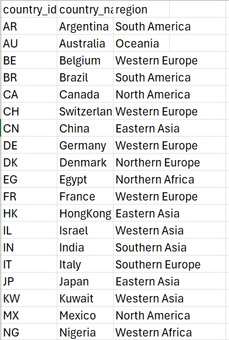
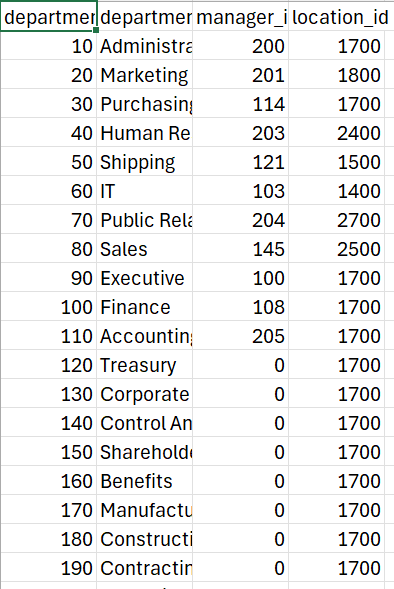

# Orion Data Systems Workforce Analytics (Capstone Project)
Analyzing workforce data to support HR and strategic decision-making at a multinational consulting and technology firm.

## Project Overview
- Orion Data Systems, headquartered in San Francisco, USA, is a global consulting and technology firm with offices across Europe, Asia, and the Americas. The HR & Strategy team required actionable insights from the company’s workforce database to optimize staffing, compensation, and departmental planning.
- This project focuses on analyzing employee data to answer key business questions related to workforce distribution, salary trends, and role coverage.

## Objectives
- Understand the distribution of employees across departments.
- Evaluate average salaries per department and identify disparities.
- Classify employees into salary bands for workforce planning.
- Analyze Orion’s global presence and department distribution by country.
- Identify high earners and critical job roles.
- Detect job roles with no employees assigned to highlight workforce gaps.
- Determine total salary spend by country for budget planning.  

## Dataset
The analysis used four primary datasets:
- employees:	Employee details including salary, department, job role, and country.
- departments:	Department information including managers and locations.
- jobs:	Job roles with minimum and maximum salary bands.
- countries:	Countries where Orion operates, with regional classification.
  
    

 ## Insights & Findings
The salary analysis reveals a clear compensation gap across departments.
- The Executive department has the highest average salary at 19,333, reflecting senior leadership responsibilities and strategic decision-making roles.
- The Shipping department has the lowest average salary at 3,476, indicating operational or entry-level job functions.
- The difference between the highest (19,333) and lowest (3,476) average salaries highlights a significant pay structure gap within the organization.
- This suggests that compensation at Orion is strongly aligned with role seniority, responsibility level, and strategic impact.
  
The workforce distribution analysis;
- It shows a significant concentration of employees in the Sales department, which has 34 employees, making it the largest department in the organization.This indicates that the company is heavily sales-driven, with a large proportion of its workforce dedicated to revenue generation activities.
  
The salary band distribution shows the following breakdown:
- Low Salary Band: 49 employees
- Medium Salary Band: 43 employees
- High Salary Band: 15 employees
- The majority of employees fall within the Low salary band (49 employees), followed closely by the Medium band (43 employees). Only 15 employees fall within the High salary band.This indicates that Orion’s workforce is largely composed of lower- to mid-level roles, with a smaller proportion of high-income senior positions.

 Country-Level Presence;
- Orion operates in multiple countries across three continents.Some countries have more departments than others, indicating regional operational priorities.
  
Job Role Analysis;
- Certain job titles have higher-than-average salaries, emphasizing the strategic value of these roles.
Other roles currently have no employees assigned, revealing potential workforce gaps.

Salary Cost by Country;
- Total salary spend varies across countries, reflecting headcount, salary levels, and regional operational scale.

 ## Recommendations
- Review staffing levels in Administration,Human Resources,and Public Relations,as they have the smallest workforce and may face workload pressure.
- Strengthen support departments alongside Sales to sustain business growth.
- Conduct regular salary reviews to address the gap between high and low-paying departments.
- Implement career development programs to help employees move from Low to Medium and High salary bands.
- Maintain a balanced workforce structure to ensure long-term payroll sustainability.
 
## Skills Demonstrated
- Data cleaning and transformation.
- Aggregation and grouping for workforce metrics.
- Country-level and department-level workforce insights.
- Identifying workforce gaps and strategic HR recommendations.

 ## Links
 [Interactive Sturucted Language Query](https://raw.githubusercontent.com/ajibade-victoria/orion_data_workforce_analytics/refs/heads/main/Orion_data_workforce.sql)
